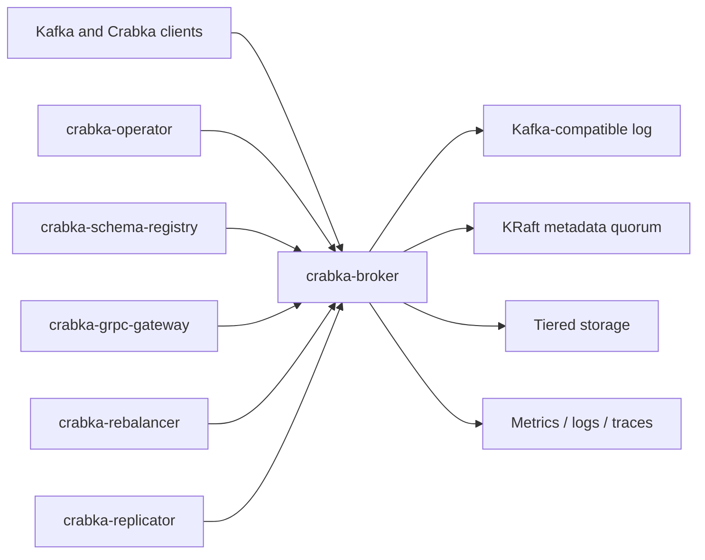

<p align="center">
  
</p>

<p align="center">
  <a href="https://github.com/robot-head/crabka/actions/workflows/ci.yml"></a>
  <a href="https://codspeed.io/robot-head/crabka?utm_source=badge"></a>
  <a href="https://codecov.io/gh/robot-head/crabka"></a>
  <a href="LICENSE"></a>
</p>

# Crabka

Crabka is a Rust implementation of [Apache Kafka](https://kafka.apache.org)
infrastructure. It speaks the Kafka wire protocol, stores records in
Kafka-compatible log segments, and runs metadata on KRaft. The test suite runs
Crabka against the official JVM clients and command-line tools.

Use Crabka when you want Kafka-compatible streaming infrastructure without a JVM
runtime. Crabka gives you memory-safe Rust, async I/O, no ZooKeeper mode, and no
GC pauses.

## Repository Status: extraction to krabka-io in progress

This repository is the original Crabka monorepo. The project is being split into
per-component repositories under the
[krabka-io](https://github.com/krabka-io) organization, where each crate is
renamed `crabka-*` to `krabka-*`.

**Most components have already moved, and the extracted repositories are ahead
of this one.** They carry restructured modules, additional tests, and crates that
do not exist here. Treat `krabka-io` as the source of truth for every component
in the table below. This repository is retained for the work that has not been
extracted yet, and for history.

| Component | Home repository |
| --------- | --------------- |
| Broker, KRaft, log, tiered storage | [krabka-broker](https://github.com/krabka-io/krabka-broker) |
| Kafka wire protocol and metadata records | [krabka-protocol](https://github.com/krabka-io/krabka-protocol) |
| Rust producer, consumer, and admin clients | [krabka-client-rs](https://github.com/krabka-io/krabka-client-rs) |
| Streams clients | [krabka-streams-rs](https://github.com/krabka-io/krabka-streams-rs), [krabka-streams-java](https://github.com/krabka-io/krabka-streams-java), [krabka-streams-go](https://github.com/krabka-io/krabka-streams-go) |
| Connect runtime, Postgres CDC, replication | [krabka-connect](https://github.com/krabka-io/krabka-connect) |
| Schema Registry | [krabka-schema-registry](https://github.com/krabka-io/krabka-schema-registry) |
| Metrics, traces, profiles, and logs | [krabka-o11y](https://github.com/krabka-io/krabka-o11y), [krabka-o11y-demo](https://github.com/krabka-io/krabka-o11y-demo) |
| Postgres-compatible engine (Gres) | [gres](https://github.com/krabka-io/gres) |
| CLI | [krabka-cli](https://github.com/krabka-io/krabka-cli) |
| Kubernetes operator | [krabka-operator](https://github.com/krabka-io/krabka-operator) |
| Partition rebalancer | [krabka-rebalancer](https://github.com/krabka-io/krabka-rebalancer) |

Components that have **not** been extracted yet, and are still maintained here:
the gRPC gateway with its four application SDKs, the admin UI, the WASM
playground, the protocol code generator, the documentation generator, the
benchmark harnesses, and the cross-crate integration suite.

Progress, including the remaining infrastructure and tooling moves, is tracked in
the [Extraction to krabka-io](https://github.com/robot-head/crabka/milestone/1)
milestone.

## Project Status

Crabka is **beta**, pre-1.0 software. The workspace version is in
[Cargo.toml](Cargo.toml).

The **0.4.0 milestone** ships metadata downgrade and client rebootstrap,
durable transaction recovery, diskless WAL failover, tiered offset reads,
CloudEvents and queue semantics in the gateway, operator lifecycle work, and
shared conformance coverage for five application SDKs. The finite outcomes for
this milestone are closed; [UNFINISHED_WORK.md](UNFINISHED_WORK.md) records the
remaining directional horizons and known limits.

The project is still greenfield infrastructure. There are no production users,
and Crabka does not promise on-disk compatibility across versions yet. Use
Crabka for evaluation, development, interoperability tests, and non-critical
workloads while the project hardens.

Kafka compatibility is the primary constraint. The repository validates protocol
encoding, record formats, storage behavior, KRaft metadata, and JVM tool
interoperability against Apache Kafka behavior. This applies where those
surfaces are in scope.

## Why Crabka

- **Kafka wire compatibility:** the build generates the protocol codecs from
  Apache Kafka message schemas and checks them byte-for-byte against
  `kafka-clients`.
- **JVM tooling works:** acceptance tests drive tools such as
  `kafka-topics.sh`, `kafka-configs.sh`, `kafka-acls.sh`,
  `kafka-consumer-groups.sh`, `kafka-leader-election.sh`, and
  `kafka-reassign-partitions.sh` against Crabka.
- **Rust runtime:** Crabka uses `tokio`, forbids unsafe code across the
  workspace, and avoids JVM heap tuning and garbage-collection behavior.
- **KRaft-native:** Crabka stores metadata in a native KRaft quorum. ZooKeeper
  mode and ZooKeeper-to-KRaft migration are out of scope.
- **Operations included:** a Kubernetes operator, Prometheus metrics, OTLP
  tracing, Helm charts, OCI images, and a Cruise-Control-style partition
  rebalancer.
- **Rust clients included:** producer, consumer, admin, streams, schema-serde,
  gateway, connector, and replication crates.

## Compatibility

Crabka targets Kafka's wire, storage, and operational semantics. JVM
implementation internals are not compatibility goals.

| Area | Status |
| ---- | ------ |
| Wire protocol and API version negotiation | Implemented |
| Kafka-compatible record batches, compression, and log segments | Implemented |
| KRaft metadata quorum and controller records | Implemented |
| Replication, ISR maintenance, leader election, and reassignment | Implemented |
| Idempotent and transactional produce / consume | Implemented |
| Classic and next-generation consumer groups | Implemented |
| Share groups / queues | Implemented |
| Tiered storage | Implemented, including Kafka 4.0 JVM segment-layout and producer-snapshot validation |
| TLS, SASL, delegation tokens, ACLs, and quotas | Implemented |
| Schema Registry-compatible REST service | Implemented |
| Kubernetes operator | Implemented, including Ingress and OpenShift Route listeners |
| Rust Streams client | Partial versus the full JVM Kafka Streams library |
| Kafka Connect-equivalent runtime | Partial; managed Postgres CDC workers, durable offsets, connector SPI, and `KafkaConnector` CRD are implemented |
| ZooKeeper mode and ZooKeeper-to-KRaft migration | Out of scope |

For the detailed per-KIP breakdown, see
[docs/KIP_MATRIX.md](docs/KIP_MATRIX.md).

For managed Postgres CDC setup, see [docs/connect.md](docs/connect.md).

## Install

Crabka is a Rust workspace. The pinned toolchain is in
[rust-toolchain.toml](rust-toolchain.toml).

```bash
git clone https://github.com/robot-head/crabka.git
cd crabka
cargo build --workspace
```

Install the local broker and CLI binaries from a checkout:

```bash
cargo install --path crates/cli
cargo install --path crates/broker
```

The Rust client crates are published independently. They are maintained in
[krabka-client-rs](https://github.com/krabka-io/krabka-client-rs), which is
ahead of the copies under [crates/](crates); use that repository for client
work.

The project publishes container images to GHCR and Docker Hub:

```bash
docker pull ghcr.io/robot-head/crabka-broker:latest
docker pull mirror.gcr.io/robothead/crabka-broker:latest
```

[packaging/README.md](packaging/README.md) gives the image build, signature,
SBOM, and attestation details. [charts/README.md](charts/README.md) documents
the Helm chart usage.

## Quick Start

Start a single local broker from the source tree:

```bash
export CRABKA_CLUSTER_ID=00000000-0000-0000-0000-000000000001
rm -rf target/crabka-data

cargo run -p crabka-cli --bin crabka -- format \
  --log-dir target/crabka-data \
  --cluster-id "$CRABKA_CLUSTER_ID" \
  --standalone \
  --node-id 1 \
  --controller-listener 127.0.0.1:9093

cargo run -p crabka-broker --bin crabka-broker -- \
  --log-dir target/crabka-data \
  --cluster-id "$CRABKA_CLUSTER_ID" \
  --broker-id 1 \
  --listen-addr 127.0.0.1:9092
```

In another shell, use normal Kafka tooling against the broker:

```bash
kafka-topics.sh \
  --bootstrap-server 127.0.0.1:9092 \
  --create \
  --topic demo \
  --partitions 1 \
  --replication-factor 1

kafka-console-producer.sh \
  --bootstrap-server 127.0.0.1:9092 \
  --topic demo

kafka-console-consumer.sh \
  --bootstrap-server 127.0.0.1:9092 \
  --topic demo \
  --from-beginning
```

`crabka format` initializes an empty log directory. To start again locally, stop
the broker and delete `target/crabka-data`.

## Documentation

- [KIP implementation matrix](docs/KIP_MATRIX.md)
- [Contributing guide](CONTRIBUTING.md)
- [Container image docs](packaging/README.md)
- [Helm chart docs](charts/README.md)
- [Benchmark harness](bench/README.md)
- [Style guides](docs/style_guides/README.md)
- [docs.rs package documentation](https://docs.rs/releases/search?query=crabka)
- [Project website](https://robot-head.github.io/crabka/)
- [krabka-io organization](https://github.com/krabka-io), which owns the
  extracted components

## Workspace

Crabka is a Cargo workspace. The main runtime path is below. The **Maintained
in** column gives the repository that now owns each layer; the crate links point
at the copies in this repository, which are frozen for extracted components.



| Layer | Key crates | Maintained in |
| ----- | ---------- | ------------- |
| Broker runtime | [`crabka-broker`](crates/broker), [`crabka-authz`](crates/authz), [`crabka-security`](crates/security), [`crabka-telemetry`](crates/telemetry) | `krabka-broker`, `krabka-protocol` |
| CLI | [`crabka-cli`](crates/cli) | `krabka-cli` |
| Protocol, records, and storage | [`crabka-protocol`](crates/protocol), [`crabka-log`](crates/log), [`crabka-raft`](crates/raft), [`crabka-metadata`](crates/metadata), [`crabka-remote-storage`](crates/remote-storage) | `krabka-protocol`, `krabka-broker` |
| Rust clients | [`crabka-client-core`](crates/client-core), [`crabka-client-producer`](crates/client-producer), [`crabka-client-consumer`](crates/client-consumer), [`crabka-client-admin`](crates/client-admin), [`crabka-client-streams`](crates/client-streams) | `krabka-client-rs`, `krabka-streams-rs` |
| Services and integration | [`crabka-schema-registry`](crates/schema-registry), [`crabka-connect`](crates/connect), [`crabka-connect-postgres`](crates/connect-postgres), [`crabka-replicator`](crates/replicator) | `krabka-schema-registry`, `krabka-connect` |
| Gateway and application SDKs | [`crabka-grpc-gateway`](crates/grpc-gateway), [`crabka-app-sdk`](crates/app-sdk), [`sdks/`](sdks) | this repository |
| Operations | [`crabka-operator`](crates/operator), [`crabka-rebalancer`](crates/rebalancer) | `krabka-operator`, `krabka-rebalancer` |
| Observability | [`crabka-blockstore`](crates/blockstore), [`crabka-metrics`](crates/metrics), [`crabka-observability`](crates/observability) | `krabka-o11y` |
| Postgres-compatible engine (Chapter Gres) | [`crabka-gres`](crates/gres), [`crabka-gres-control`](crates/gres-control), [`crabka-gres-balancer`](crates/gres-balancer), [`crabka-pgexec`](crates/pgexec), [`crabka-pgwire`](crates/pgwire), [`crabka-pgtypes`](crates/pgtypes), [`crabka-pgparser`](crates/pgparser), [`crabka-pgkv`](crates/pgkv), [`crabka-pgmvcc`](crates/pgmvcc), [`crabka-pgcatalog`](crates/pgcatalog), [`crabka-gres-fdw`](crates/gres-fdw) | `gres` |
| Tooling and harnesses | [`crabka-protocol-codegen`](crates/protocol-codegen), [`crabka-docgen`](crates/docgen), [`crabka-bench-driver`](crates/bench-driver), [`crabka-admin-ui`](crates/admin-ui), [`crabka-playground`](crates/playground) | this repository |

Crate READMEs and rustdoc contain API-level usage details. For an extracted
component, read them in its home repository rather than here.

## Development

Prerequisites:

- Rust toolchain from [rust-toolchain.toml](rust-toolchain.toml)
- JDK 17 for JVM differential tests
- Docker or a compatible container runtime for integration tests that use Kafka
  containers

Common checks:

```bash
cargo build --workspace
cargo fmt --check
cargo clippy --workspace --all-targets -- -D warnings
cargo test --workspace
```

Run JVM-backed differential and acceptance tests:

```bash
(cd tools/oracle && ./gradlew installDist)
cargo test --workspace -- --include-ignored
```

Regenerate the protocol code after you edit the Kafka schemas:

```bash
./tools/regenerate.sh
git diff crates/protocol/generated
```

[CONTRIBUTING.md](CONTRIBUTING.md) gives more contributor workflow details.

## Roadmap

The near-term roadmap for this repository is the extraction itself: finishing the
moves in the
[Extraction to krabka-io](https://github.com/robot-head/crabka/milestone/1)
milestone, and finding a home for the gateway, SDK, tooling, and infrastructure
work that has none yet.

Per-component roadmaps live in the repositories that own them. Work that
continues here:

- The gRPC gateway and its four application SDKs, with shared conformance
  coverage.
- The protocol code generator that tracks upstream Kafka message schemas.
- The benchmark harnesses and the cross-crate integration suite.

[docs/KIP_MATRIX.md](docs/KIP_MATRIX.md) and the design notes under
[docs/superpowers/specs](docs/superpowers/specs) give the detailed
implementation status for this repository. They are not updated for changes made
in the extracted repositories.

## Contributing

Contributions are welcome. Check the table in
[Repository Status](#repository-status-extraction-to-krabka-io-in-progress)
first: for an extracted component, open the issue or pull request in its home
repository under [krabka-io](https://github.com/krabka-io), because changes
landed here will not reach it.

For the work still maintained here, start with
[CONTRIBUTING.md](CONTRIBUTING.md). Open an issue for a large design or
compatibility change. Keep Kafka wire and behavior compatibility as the primary
constraint.

Run `cargo fmt --check`, `cargo clippy --workspace --all-targets -- -D warnings`,
and the relevant tests before you open a pull request. `release-plz` uses
conventional commits for automated versioning and changelog generation.

## Security

Crabka includes authentication, authorization, TLS, mTLS, delegation-token, and
OPA integration work, but it is still beta infrastructure. Do not use it as the
sole security boundary for critical production systems yet.

If you find a security vulnerability, do not post exploit details in a public
issue. Use GitHub private vulnerability reporting if the repository has it
enabled. If not, contact the maintainers privately through the repository owner.

## License

Crabka is licensed under the Apache License, Version 2.0. See
[LICENSE](LICENSE) and [NOTICE](NOTICE).

## Acknowledgements

Crabka is a derivative, compatibility-focused implementation of Apache Kafka
protocols, record formats, and operational semantics. The project depends on the
Apache Kafka schema corpus and JVM client/tool behavior as its compatibility
oracle.
