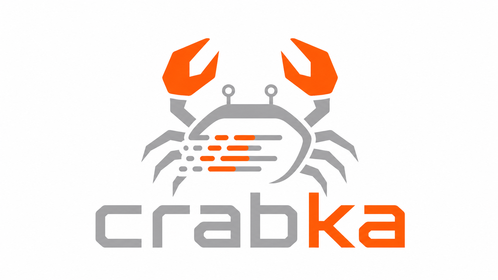

<p align="center">
  
</p>

<p align="center">
  <a href="https://github.com/robot-head/crabka/actions/workflows/ci.yml"></a>
  <a href="https://codspeed.io/robot-head/crabka?utm_source=badge"></a>
  <a href="https://codecov.io/gh/robot-head/crabka"></a>
  <a href="LICENSE"></a>
  <a href="rust-toolchain.toml"></a>
</p>

# Crabka

Crabka is a Rust reimplementation of [Apache Kafka](https://kafka.apache.org).
It speaks the Kafka wire protocol, stores records in Kafka-compatible log
segments, runs metadata on KRaft, and is validated against the official JVM
clients and command-line tooling.

Crabka is built for people who want Kafka-compatible streaming infrastructure
without the JVM runtime: memory-safe Rust, async I/O, no ZooKeeper, no GC pauses,
and a workspace that also includes native Rust clients, Schema Registry, a gRPC /
Connect-RPC gateway, a Kubernetes operator, a partition rebalancer, and
cross-cluster replication.

## Table of Contents

- [Project Status](#project-status)
- [Why Crabka](#why-crabka)
- [Features](#features)
- [Feature Compatibility](#feature-compatibility)
- [Installation](#installation)
- [Quick Start](#quick-start)
- [Documentation](#documentation)
- [Architecture](#architecture)
- [Workspace Packages](#workspace-packages)
- [Development](#development)
- [Performance](#performance)
- [Roadmap](#roadmap)
- [Contributing](#contributing)
- [Security](#security)
- [License](#license)
- [Acknowledgements](#acknowledgements)

## Project Status

Crabka is **beta**, pre-1.0 software. The workspace version is currently
`0.3.7`.

The Kafka-facing surface is broad: wire protocol, log storage, replication,
KRaft metadata, authorization, quotas, tiered storage, transactions, consumer
groups, share groups, Schema Registry, Kubernetes operation, and Rust clients
are all implemented to meaningful depth and tested against JVM Kafka behavior.

The important caveat: Crabka is still greenfield infrastructure. It has no
production users and does not yet promise on-disk compatibility across versions.
Use it for evaluation, development, interoperability testing, and non-critical
workloads while the project hardens.

## Why Crabka

- **Kafka wire compatibility.** Protocol codecs are generated from Apache Kafka
  message schemas and checked byte-for-byte against `kafka-clients`.
- **Works with JVM tooling.** The acceptance suite drives tools such as
  `kafka-topics.sh`, `kafka-configs.sh`, `kafka-acls.sh`,
  `kafka-consumer-groups.sh`, `kafka-leader-election.sh`, and
  `kafka-reassign-partitions.sh` against a live Crabka broker.
- **Rust runtime.** Crabka uses `tokio`, forbids unsafe code across the
  workspace, and avoids JVM heap tuning and GC behavior.
- **KRaft-native.** Metadata is stored in a native KRaft quorum; ZooKeeper mode
  is deliberately out of scope.
- **Operations included.** The repository ships a Kubernetes operator,
  Prometheus metrics, OTLP tracing, Helm charts, OCI images, and a
  Cruise-Control-style rebalancer.
- **Rust ecosystem first-class.** Native producer, consumer, admin, streams,
  schema-serde, gateway, connector, and replication crates live in the same
  workspace.

## Features

### Broker

- Kafka wire protocol targeting the Apache Kafka 4.x schema surface.
- Byte-compatible record batches, log segments, indexes, transaction indexes,
  compaction, retention, JBOD, and tiered storage.
- KRaft metadata quorum, snapshots, dynamic voters, controller-only and
  broker-only process roles, replication, ISR maintenance, leader election, and
  partition reassignment.
- Idempotent and transactional producers, read-committed fetches, consumer
  groups, next-generation consumer protocol support, share groups, and Streams
  group task assignment.
- TLS/mTLS, SASL/PLAIN, SASL/SCRAM-SHA-256/512, SASL/OAUTHBEARER,
  SASL/GSSAPI/Kerberos, delegation tokens, ACLs, quotas, and an OPA authorizer
  bridge.

### Clients and Services

- Native Rust producer, consumer, admin, and KIP-1071 Streams clients.
- Confluent Schema Registry-compatible REST service.
- gRPC / Connect-RPC and HTTP gateway for Kafka topics.
- Connector framework SPI plus a Postgres logical-decoding source connector.
- Cross-cluster geo-replication service with MirrorMaker-2-compatible records.

### Operations

- Kubernetes operator with Strimzi-style cluster resources.
- Helm charts for the operator, Schema Registry, and rebalancer.
- Multi-arch OCI images for broker, operator, Schema Registry, and benchmark
  driver.
- Prometheus metrics and OTLP distributed tracing.
- Benchmark harness for Crabka-vs-Strimzi comparisons.

## Feature Compatibility

Crabka's compatibility target is Kafka's wire, storage, and operational
semantics. JVM implementation internals, ZooKeeper mode, and ZooKeeper-to-KRaft
migration are not goals.

| Area | Status |
| ---- | ------ |
| Wire protocol and API version negotiation | Implemented |
| Kafka-compatible record batches, compression, and log segments | Implemented |
| KRaft metadata quorum and controller records | Implemented |
| Replication, ISR maintenance, leader election, and reassignment | Implemented |
| Idempotent and transactional produce / consume | Implemented |
| Classic and next-generation consumer groups | Implemented |
| Share groups / queues | Implemented |
| Tiered storage | Implemented, with segment-data JVM interop still being validated |
| TLS, SASL, delegation tokens, ACLs, and quotas | Implemented |
| Schema Registry-compatible REST service | Implemented |
| Kubernetes operator | Implemented, with some external listener surfaces still maturing |
| Rust Streams client | Partial versus the full JVM Kafka Streams library |
| Kafka Connect-equivalent runtime | Partial; connector SPI exists and continues to evolve |
| ZooKeeper mode and ZK-to-KRaft migration | Out of scope |

For the detailed per-KIP breakdown, see
[docs/KIP_MATRIX.md](docs/KIP_MATRIX.md).

## Installation

### From Source

Crabka is a Rust workspace. The pinned toolchain lives in
[rust-toolchain.toml](rust-toolchain.toml).

```bash
git clone https://github.com/robot-head/crabka.git
cd crabka
cargo build --workspace
```

To install the local broker and CLI binaries:

```bash
cargo install --path crates/cli
cargo install --path crates/broker
```

### From crates.io

Crabka publishes its Rust crates independently. For example:

```bash
cargo add crabka-client-producer
cargo add crabka-client-consumer
cargo add crabka-client-admin
```

### Containers

Release images are published to both GHCR and Docker Hub:

```bash
docker pull ghcr.io/robot-head/crabka-broker:latest
docker pull mirror.gcr.io/robothead/crabka-broker:latest
```

Image build, signing, SBOM, and attestation details are in
[packaging/README.md](packaging/README.md).

### Helm

```bash
helm repo add crabka https://robot-head.github.io/crabka/charts
helm repo update
helm search repo crabka
```

Chart usage and provenance verification are documented in
[charts/README.md](charts/README.md).

## Quick Start

Start a single local broker from the source tree:

```bash
export CRABKA_CLUSTER_ID=00000000-0000-0000-0000-000000000001
rm -rf target/crabka-data

cargo run -p crabka-cli --bin crabka -- format \
  --log-dir target/crabka-data \
  --cluster-id "$CRABKA_CLUSTER_ID" \
  --standalone \
  --node-id 1 \
  --controller-listener 127.0.0.1:9093

cargo run -p crabka-broker --bin crabka-broker -- \
  --log-dir target/crabka-data \
  --cluster-id "$CRABKA_CLUSTER_ID" \
  --broker-id 1 \
  --listen-addr 127.0.0.1:9092
```

In another shell, use normal Kafka tooling against the broker:

```bash
kafka-topics.sh \
  --bootstrap-server 127.0.0.1:9092 \
  --create \
  --topic demo \
  --partitions 1 \
  --replication-factor 1

kafka-console-producer.sh \
  --bootstrap-server 127.0.0.1:9092 \
  --topic demo

kafka-console-consumer.sh \
  --bootstrap-server 127.0.0.1:9092 \
  --topic demo \
  --from-beginning
```

`crabka format` is a one-time initialization step for an empty log directory. To
start over locally, stop the broker and remove `target/crabka-data`.

## Documentation

- [docs.rs package documentation](https://docs.rs/releases/search?query=crabka)
- [KIP implementation matrix](docs/KIP_MATRIX.md)
- [Contributing guide](CONTRIBUTING.md)
- [Known issues](KNOWN_ISSUES.md)
- [Container image docs](packaging/README.md)
- [Helm chart docs](charts/README.md)
- [Benchmark harness](bench/README.md)
- [Project website](https://robot-head.github.io/crabka/)

## Architecture

Crabka is organized as a Cargo workspace. The main runtime path is:


| Layer | Key crates |
| ----- | ---------- |
| Protocol and records | `crabka-protocol`, `crabka-protocol-codegen`, `crabka-compression`, `crabka-records-legacy` |
| Storage and metadata | `crabka-log`, `crabka-metadata`, `crabka-raft`, `crabka-kraft-core`, `crabka-voters` |
| Broker runtime | `crabka-broker`, `crabka-authz`, `crabka-security`, `crabka-telemetry` |
| Clients | `crabka-client-core`, `crabka-client-producer`, `crabka-client-consumer`, `crabka-client-admin`, `crabka-client-streams` |
| Services | `crabka-schema-registry`, `crabka-grpc-gateway`, `crabka-replicator` |
| Connect | `crabka-connect`, `crabka-connect-derive`, `crabka-connect-postgres`, `crabka-schema-serde` |
| Operations | `crabka-cli`, `crabka-operator`, `crabka-rebalancer`, `crabka-bench-driver`, `crabka-docgen` |

## Workspace Packages

| Package | Purpose |
| ------- | ------- |
| [`crabka-broker`](crates/broker) | Kafka-compatible broker runtime |
| [`crabka-cli`](crates/cli) | Operator CLI, installed as `crabka` |
| [`crabka-client-admin`](crates/client-admin) | Admin client |
| [`crabka-client-consumer`](crates/client-consumer) | Subscribe-style consumer client |
| [`crabka-client-core`](crates/client-core) | Connection management and request dispatch |
| [`crabka-client-producer`](crates/client-producer) | Idempotent and transactional producer client |
| [`crabka-client-streams`](crates/client-streams) | KIP-1071 Streams client and runtime |
| [`crabka-schema-registry`](crates/schema-registry) | Confluent Schema Registry-compatible service |
| [`crabka-grpc-gateway`](crates/grpc-gateway) | gRPC / Connect-RPC and HTTP gateway |
| [`crabka-operator`](crates/operator) | Kubernetes operator |
| [`crabka-rebalancer`](crates/rebalancer) | Cruise-Control-style partition rebalancer |
| [`crabka-replicator`](crates/replicator) | Cross-cluster geo-replication service |
| [`crabka-connect`](crates/connect) | Connector framework SPI |
| [`crabka-connect-postgres`](crates/connect-postgres) | Postgres logical-decoding source connector |
| [`crabka-schema-serde`](crates/schema-serde) | Confluent-compatible schema serdes |
| [`crabka-protocol`](crates/protocol) | Kafka wire-protocol codec |
| [`crabka-log`](crates/log) | Kafka-compatible log segment reader/writer |
| [`crabka-raft`](crates/raft) | KRaft metadata quorum |
| [`crabka-remote-storage`](crates/remote-storage) | KIP-405 tiered-storage SPI |
| [`crabka-remote-storage-topic`](crates/remote-storage-topic) | Topic-backed remote-log metadata manager |
| [`crabka-security`](crates/security) | TLS, SASL, SCRAM, OAuth, and Kerberos utilities |
| [`crabka-authz`](crates/authz) | Kafka ACL authorization evaluator |

## Development

### Prerequisites

- Rust toolchain from [rust-toolchain.toml](rust-toolchain.toml)
- JDK 17 for JVM differential tests
- Docker or a compatible container runtime for integration tests that use Kafka
  containers

### Common Commands

```bash
cargo build --workspace
cargo fmt --check
cargo clippy --workspace --all-targets -- -D warnings
cargo test --workspace
```

Run JVM-backed differential and acceptance tests:

```bash
(cd tools/oracle && ./gradlew installDist)
cargo test --workspace -- --include-ignored
```

Regenerate protocol code after editing Kafka schemas:

```bash
./tools/regenerate.sh
git diff crates/protocol/generated
```

More contributor workflow details are in [CONTRIBUTING.md](CONTRIBUTING.md).

## Performance

The benchmark harness compares Crabka and Strimzi-managed Apache Kafka under the
same Kubernetes resources and the same Kafka wire-protocol load driver.

Highlights from the current benchmark report:

- Crabka uses a low-hundreds-of-MiB working set where comparable Strimzi brokers
  are JVM-heap dominated.
- Small-record and `acks=all` workloads are competitive with, or faster than,
  the comparable Kafka setup.
- Fetch responses use zero-copy `sendfile(2)` where supported; Linux kTLS keeps
  encrypted fetches on the zero-copy path.

Read the full report:
[Crabka vs Strimzi on Kubernetes](https://robot-head.github.io/crabka/benchmarks/crabka-vs-strimzi/).

## Roadmap

Near-term work focuses on production hardening and compatibility depth:

- More JVM interop coverage for edge-case protocol and storage behavior.
- Continued Kubernetes operator maturity.
- More complete Connect runtime and connector surfaces.
- Better documentation for deployment, security, and operations.
- Compatibility and upgrade testing as the project approaches 1.0.

Detailed implementation status lives in [docs/KIP_MATRIX.md](docs/KIP_MATRIX.md)
and the design notes under [docs/superpowers/specs](docs/superpowers/specs).

## Contributing

Contributions are welcome. Start with:

1. Read [CONTRIBUTING.md](CONTRIBUTING.md).
2. Open an issue for substantial design or compatibility changes.
3. Keep Kafka wire and behavior compatibility as the primary constraint.
4. Run `cargo fmt --check`, `cargo clippy --workspace --all-targets -- -D warnings`,
   and the relevant tests before opening a pull request.

Conventional commits are used by `release-plz` for automated versioning and
changelog generation.

## Security

Crabka includes authentication, authorization, TLS, mTLS, delegation-token, and
OPA integration work, but the project is still beta infrastructure. Do not use it
as the sole security boundary for critical production systems yet.

If you believe you have found a security vulnerability, please avoid posting
exploit details in a public issue. Use GitHub private vulnerability reporting if
it is enabled for the repository, or contact the maintainers privately through
the repository owner.

## License

Crabka is licensed under the Apache License, Version 2.0. See
[LICENSE](LICENSE) and [NOTICE](NOTICE).

## Acknowledgements

Crabka is a derivative, compatibility-focused implementation of Apache Kafka
protocols, record formats, and operational semantics. The project depends on the
Apache Kafka schema corpus and JVM client/tool behavior as its compatibility
oracle.
