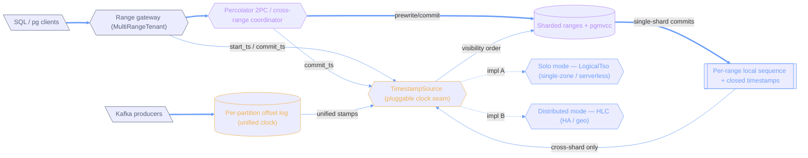

# Two-mode write scaling: solo TSO ↔ distributed HLC

_Decision record exported from a nodestorm brainstorm on 2026-07-20._

**10 components · 6 decided · 0 dismissed · 0 open**

## Architecture

_Color = status: gray existing · blue proposed · amber modified · purple affected · red dashed removed._

### Components

- **SQL / pg clients** (external, existing) — Interactive transactions via pgwire. Need SI/serializable across ranges.
- **Kafka producers** (external, existing) — Append-only writes; per-partition order is the whole contract.
- **Range gateway (MultiRangeTenant)** (service, existing) — Per-tenant router. Resolves keys to ranges, drives 2PC, fronts the TSO via BatchedTsoClient.
- **TimestampSource (pluggable clock seam)** (service, modified) — The ordering primitive is now an ABSTRACTION, not a fixed oracle. Commit path / Percolator intents / visibility (commit_ts <= read_ts) operate on an opaque comparable Timestamp. Two impls plug in per deployment mode. A logical timestamp IS a valid HLC with a frozen physical component — so the two impls are two points on one spectrum, not two stacks.
- **Percolator 2PC / cross-range coordinator** (service, affected) — Prewrite intents (primary/secondary), commit_ts > start_ts, first-committer-wins. GTM-xid 2PC across ranges (LocalCoordinator/NetCoordinator).
- **Sharded ranges + pgmvcc** (data_store, affected) — Hash-sharded ranges; MVCC versions with visibility rule commit_ts <= read_ts. Where lock/storage contention actually lives.
- **Per-partition offset log (unified clock)** (data_store, modified) — UNIFY chosen: Kafka records now also carry a TimestampSource stamp as an ADDITIONAL cross-domain coordinate, enabling atomic Kafka+SQL transactions. Constraint: the on-wire offset, record batch format, and per-partition order stay byte-exact — the stamp is layered on, it does not replace offset semantics.
- **Solo mode — LogicalTso (single-zone / serverless)** (service, proposed) — Your current hardened range-0 logical oracle. Single zone, lowest latency, exhaustively modeled. Scale-to-zero friendly: no wall-clock dependency, resume = recover the persisted horizon. Autoscale writes = add shards; single-shard fast path keeps each shard off the central counter. Kafka takes logical stamps from the same source (unified, cheaply).
- **Distributed mode — HLC (HA / geo)** (service, proposed) — Hybrid Logical Clock per node/region. No central RTT floor, no single failure domain. Cross-shard commit_ts = max(participant HLCs); reads handle an uncertainty window. The shared physical-ish clock is what lets a Kafka partition and a SQL row share a cross-domain order. Accept slightly less efficiency for HA+geo.
- **Per-range local sequence + closed timestamps** (module, proposed) — The single-shard bypass you chose. Each range sequences its own single-shard commits from a local monotone number and publishes a closed-timestamp watermark. The global TimestampSource is invoked ONLY for cross-shard txns. This is exactly the per-partition-offset pattern the Kafka side already proves — works identically under LogicalTso or HLC.

## Decisions

### How do the two modes share code? — TimestampSource (pluggable clock seam)

You chose two optimization routes. The cheapest-to-maintain expression of that is the open question: one clock with two regimes, a trait with two impls, or two separate stacks.

**Decision: One TimestampSource trait, two impls (LogicalTso / HLC) ★ agent-recommended** — Commit path, Percolator, and visibility depend only on an opaque comparable Timestamp. LogicalTso and HLC are two implementations selected at provision time.

- Pros: Mode A stays pure-logical, scale-to-zero-friendly, and keeps the exhaustive Stateright model; Mode B gets real HLC only where geo/HA needs it — no uncertainty cost paid in solo; Single commit/visibility code path; the fork is isolated behind one trait; A logical ts is a degenerate HLC, so the impls stay conceptually unified
- Cons (accepted): Two impls to test and maintain; Mode is chosen at provision time; switching needs a defined transition

Also considered:

- **One HLC everywhere, degenerate in solo** — Run HLC always; in solo it's a single writer with uncertainty=0, effectively the logical counter. (pros: Exactly one mechanism to build, test, and model; No transition step — same clock scales from solo to geo; cons: Solo pays HLC's physical-clock machinery for zero benefit; Scale-to-zero must reconcile physical clock on wake (drift while suspended); Loses the pure-logical 'timestamp is its own proof' property in the common case)
- **Two independent ordering stacks** — Separate solo and distributed implementations with little shared abstraction. (pros: Each mode maximally optimized with no abstraction tax; cons: Duplicated commit/visibility/Percolator logic — double the surface to keep correct; Divergence risk; cross-mode reasoning is hard; No natural transition path)

_Decided 2026-07-20._

### How does a deployment move solo → production (HA/geo)? — TimestampSource (pluggable clock seam)

You framed Mode B as 'now moving into production.' That transition needs a defined story — and a logical timestamp is precisely the logical half of an HLC, which makes one option very clean.

**Decision: Live promotion: seed HLC.logical from the LogicalTso horizon ★ agent-recommended** — On promotion, HLC.logical starts at the persisted TSO horizon and physical starts at now(); monotonicity is preserved because a logical ts is a valid HLC. No data migration.

- Pros: Monotone by construction — no timestamp can go backwards across the switch; No dump/reload; existing intents and versions stay valid; Turns the two impls into a continuum rather than a cliff
- Cons (accepted): Requires a careful one-time promotion protocol (fence solo TSO, seed, distribute); Only clean if mode-sharing is the pluggable trait or one-HLC

Also considered:

- **Re-bootstrap a fresh production cluster** — Provision prod as a new distributed cluster; load data in. Greenfield-friendly, no live promotion code. (pros: Zero promotion machinery; simplest to build first; Clean slate for the distributed topology; cons: Not a live upgrade — requires a data reload / cutover; Downtime or dual-write during migration)
- **No transition — always run the distributed mechanism** — Even solo runs HLC; there's nothing to promote. (Couples tightly to one-hlc-two-regimes.) (pros: No transition concept at all; cons: Contradicts the solo-efficiency goal you set; Only coherent under one-HLC-two-regimes)

_Decided 2026-07-20._

### How does a transaction spanning Kafka partitions AND SQL rows commit atomically? — Percolator 2PC / cross-range coordinator

Unifying the clock (additive coordinate) enables cross-domain txns, but the clock only gives shared ORDER — atomic commit across two different transaction systems still needs a coordinator decision.

**Decision: One 2PC coordinator; Kafka partition is another participant ★ agent-recommended** — The gres cross-range coordinator (GTM xid + prepare/commit) becomes the top-level coordinator. A Kafka partition joins as a resource manager: prepare = stage pending offsets + write markers, commit = advance LSO. All keyed by the shared stamp.

- Pros: Reuses the existing LocalCoordinator/NetCoordinator 2PC state machine; One decision authority — no cross-system agreement protocol to invent; Kafka's own EOS machinery (markers, LSO, pending offsets) already looks like a prepare/commit RM
- Cons (accepted): Couples the broker txn path to the gres coordinator — a new dependency edge; Kafka commit latency now includes the 2PC round

Also considered:

- **Two coordinators linked by a shared GTID + stamp** — Kafka txn coordinator and gres coordinator each own their domain; a thin bridge drives both to commit under one global xid and the unified stamp. (pros: Each domain keeps its own coordinator unchanged; Looser coupling between broker and gres; cons: Two authorities — needs an agreement/orphan-resolution protocol between them; More failure modes (one commits, one doesn't); Duplicates decision logic)
- **Unify order only — no atomic cross-domain writes yet** — The shared stamp gives cross-domain snapshot/read ordering; atomic cross-domain WRITES are deferred to a later phase. (pros: Smallest scope now; gets the read/ordering benefit immediately; No coupling of the two commit paths yet; cons: No 'write a row + emit an event atomically' — the headline unify feature is postponed; May need rework when added later)

_Decided 2026-07-20._

### Should single-shard commits bypass the global sequencer entirely? — Sharded ranges + pgmvcc

This lever matters under EVERY mechanism above. If a txn touches one range, its commit order can come from that range's own monotone sequence — the global oracle is only needed to order across ranges.

**Decision: Single-shard commits use a local per-range sequence ★ agent-recommended** — Only multi-shard txns pull a global timestamp; single-shard commits get a local monotone number and publish a per-range closed timestamp for cross-range reads.

- Pros: Removes the common case from the global sequencer — the biggest real win; Keeps the global mechanism's load proportional to cross-shard traffic, not total writes
- Cons (accepted): Cross-range snapshot reads must reconcile per-range clocks (closed-timestamp watermark); Read path gets more complex

Also considered:

- **Every commit takes a global timestamp (current)** — Uniform path: all commits, single- or multi-shard, get a global commit_ts. Simplest, current behavior. (pros: One code path; trivially correct global order; No per-range watermark reconciliation; cons: Every write pays the global sequencer even when it didn't need to; Concentrates all load on the one mechanism)

_Decided 2026-07-20._

### How to unify Kafka under one clock without breaking wire byte-exactness? — Per-partition offset log (unified clock)

Kafka wire-protocol byte exactness is the one hard constraint in this repo. Unifying the clock must not touch offset semantics or record format.

**Decision: Stamp is an additional internal coordinate; offsets untouched ★ agent-recommended** — The per-partition offset stays the sole on-wire ordering and record format is byte-exact. The TimestampSource stamp is stored internally alongside, used only for cross-domain txn ordering and snapshot reads.

- Pros: Kafka clients see zero change — offsets, LSO, batch format all byte-exact; Cross-domain (Kafka+SQL) atomicity available where wanted; No risk to KIP semantics or JVM admin-tool behavior
- Cons (accepted): Extra internal per-record metadata (storage cost); Cross-domain txns must map offset order and stamp order consistently

Also considered:

- **Clock stamp participates in visible ordering** — Let the shared stamp influence Kafka-visible ordering/offset assignment. (pros: Tighter single global order across domains; cons: Risks diverging from Kafka's exact offset/LSO semantics — violates the repo's hard constraint; Could break kafka-topics / EOS consumer expectations)

_Decided 2026-07-20._

### How does distributed mode handle read consistency under clock uncertainty? — Distributed mode — HLC (HA / geo)

HLC's correctness cost is concentrated at reads. This is the core Mode-B safety decision.

**Decision: Uncertainty window + read restart (CockroachDB model) ★ agent-recommended** — Reads carry a max_offset uncertainty interval; a value seen inside it forces a restart at a higher ts. No special hardware.

- Pros: Works on commodity NTP; no clock hardware requirement; Well-understood, proven at scale; Bounded skew is the only assumption
- Cons (accepted): Read-restart amplification under contention; Tail latency spikes when clocks are loosely synced

Also considered:

- **Commit-wait on a tight clock bound (Spanner/TrueTime)** — Wait out the uncertainty at commit; needs GPS/atomic or PTP-grade time (AWS TimeSync, PTP). (pros: External consistency with no read restarts; Clean linearizability story; cons: Needs tight-clock infrastructure — heavier ops requirement; Adds commit latency (the wait) to every write)
- **Closed-timestamp / bounded-staleness reads** — Serve most reads from a closed-timestamp watermark slightly in the past; avoids uncertainty for read-heavy paths. (pros: No restarts for the read-mostly path; great follower/geo reads; Reuses the closed timestamps the fast path already publishes; cons: Reads see slightly stale snapshots (not linearizable by default); Needs an explicit fresh-read path for read-your-writes)

_Decided 2026-07-20._

## Questions answered

- **What's the actual scaling driver here — and the target?** (TimestampSource) — Two optimization routes: (1) a non-HA/single-zone route that maximizes performance and efficiency, autoscales writes, and scales to zero during inactivity; (2) a production route with HA/geo-distribution, accepting slightly less efficiency. _(answered 2026-07-20)_

## Summary

The "is Percolator's oracle the best mechanism for horizontal write scalability?" question resolves not to a winner but to a **seam**: ordering becomes a pluggable `TimestampSource` (opaque comparable timestamp) with two implementations — **LogicalTso** for the solo/serverless single-zone route and **HLC** for the HA/geo production route — where a logical timestamp is a degenerate HLC, making the two a continuum rather than rival stacks. The actual horizontal-write win comes from the **single-shard local-sequence bypass** (the common case never touches the global clock), which is mechanism-agnostic and mirrors the Kafka per-partition offset design already in the codebase. Kafka is unified under the same clock **additively** (offsets stay byte-exact), cross-domain Kafka+SQL transactions commit through a **single 2PC coordinator** (Kafka partition as resource manager), and promotion from solo to production **seeds HLC.logical from the LogicalTso horizon** so timestamps stay monotone with no data migration.
