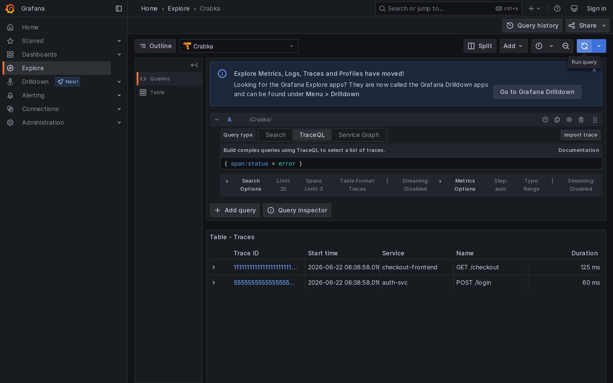
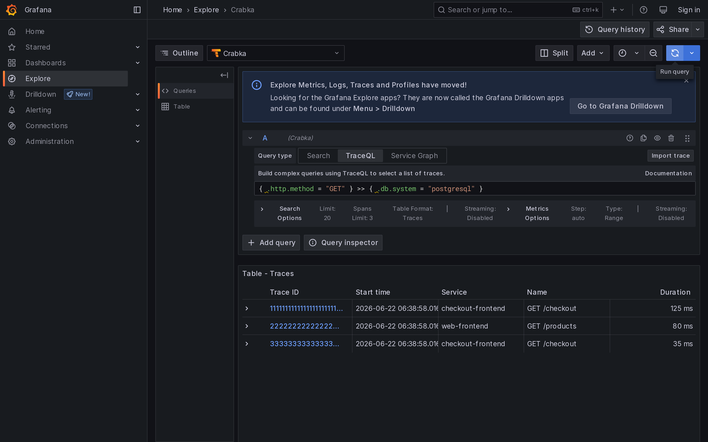
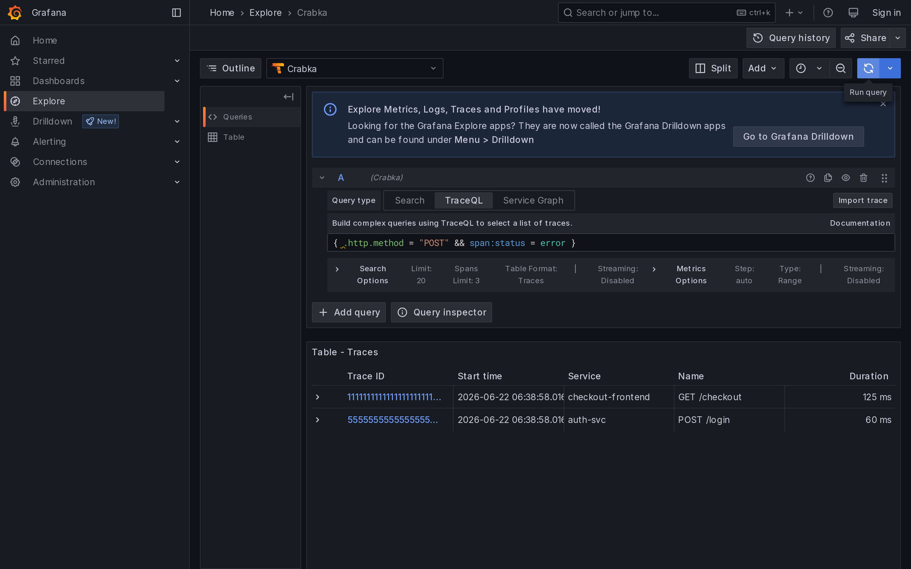
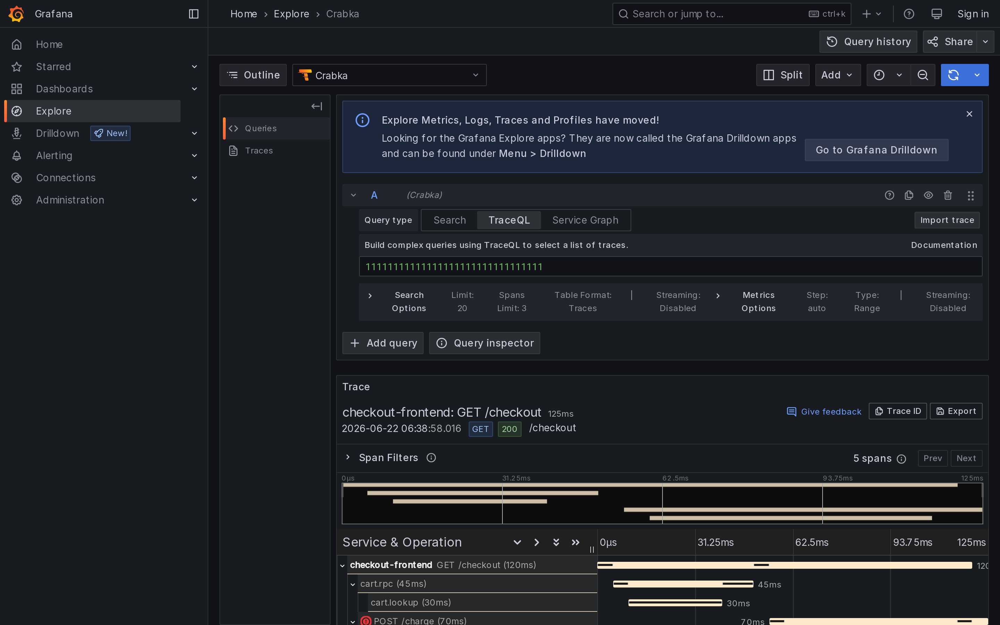

# Traces — Grafana screenshots

Grafana Explore running TraceQL against Crabka's traces backend through the
Tempo-compatible HTTP API. Each image is a 2880×1800 (1440×900 @ 2× DPI) capture
of a distinct query class.

## Attribute selector

`{ resource.service.name = "checkout-frontend" }`

Resource-scoped attribute match returned as a trace list.

## Error intrinsic

`{ span:status = error }`

Filtering on the `span:status` intrinsic.

## Duration intrinsic

`{ span:duration > 100ms }`

Numeric comparison on the `span:duration` intrinsic with a duration literal.

## Structural — descendant

`{ .http.method = "GET" } >> { .db.system = "postgresql" }`

The `>>` descendant operator joining two spansets, returning traces where a
`GET` span has a PostgreSQL span somewhere beneath it.

## Boolean composition

`{ .http.method = "POST" && span:status = error }`

A single spanset combining an attribute predicate and an intrinsic with `&&`.

## Trace waterfall

The TraceByID detail view — Grafana fetches the full trace over the Tempo API
and renders the span tree with timing bars.

